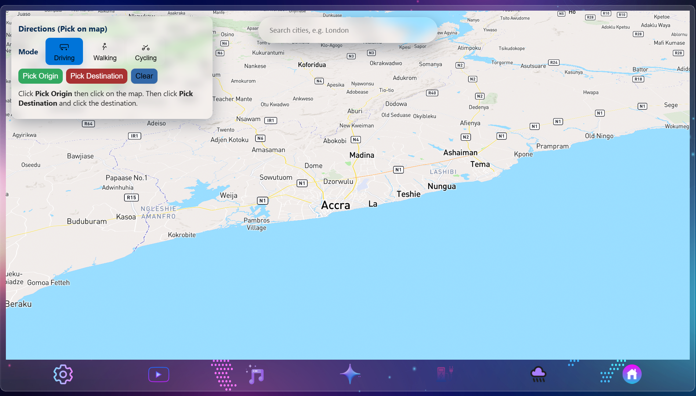
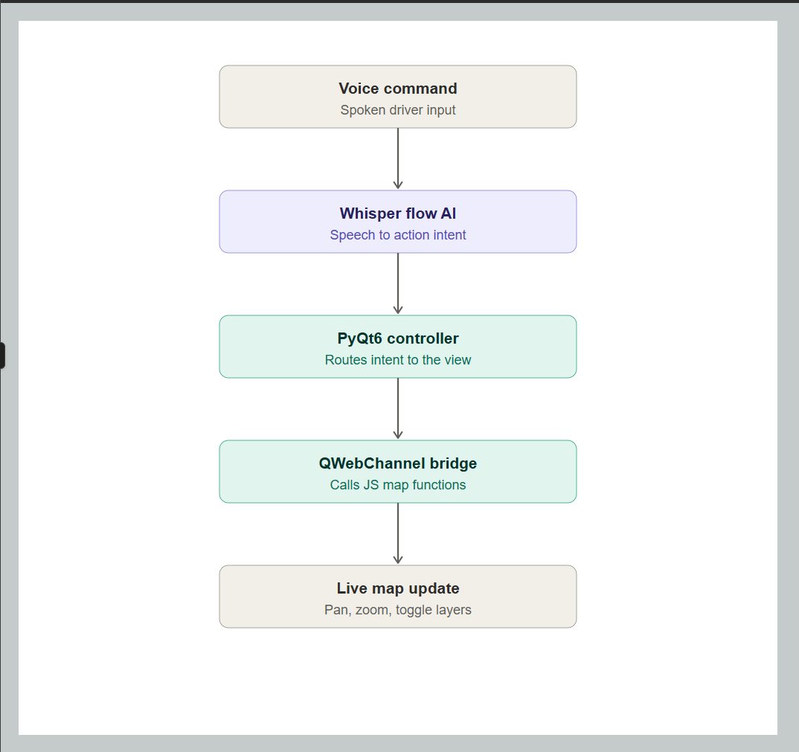
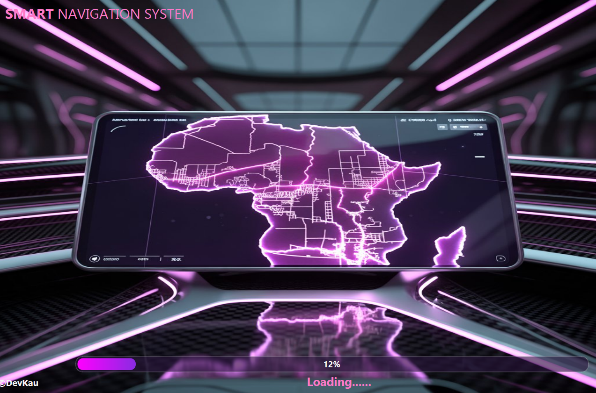
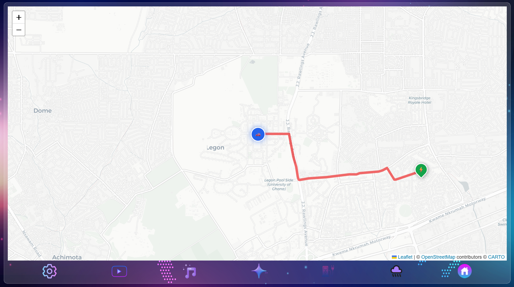
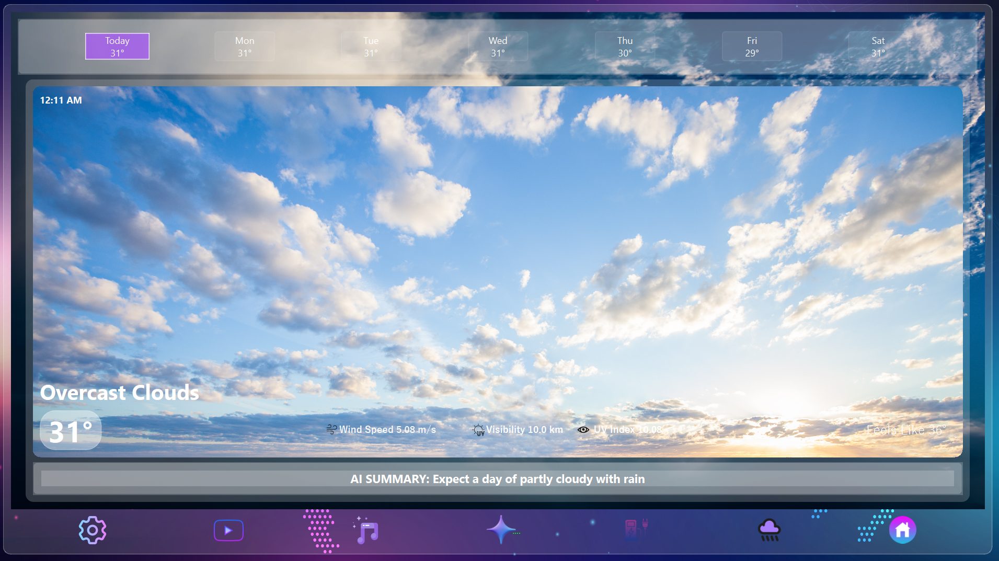
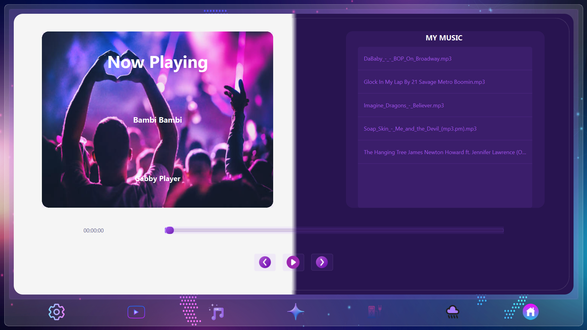
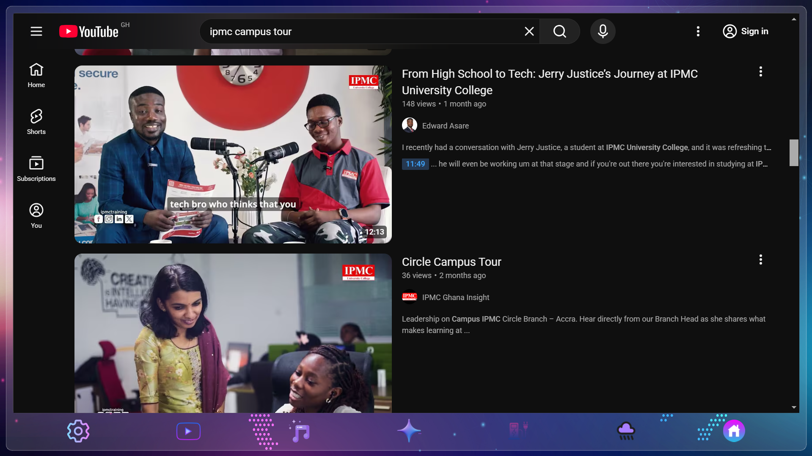
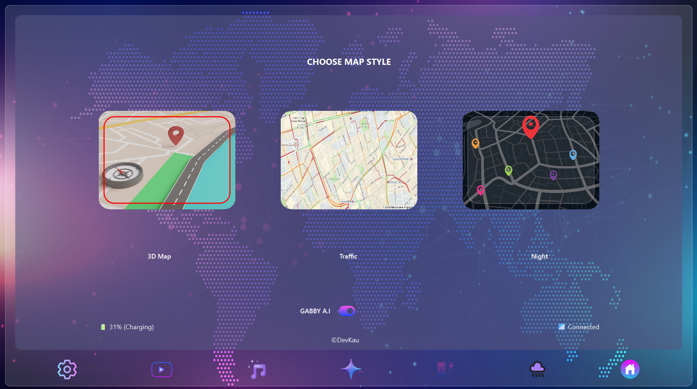

# 🧭 Smart Navigation Dashboard — Voice-Controlled Hands-Free Traffic System

<p align="center">
  
  
  
  
</p>

> An intelligent, voice-operated in-vehicle desktop application that eliminates manual driver distraction. Instead of touchscreen or mouse input while driving, the entire mapping and traffic interface is controlled through natural spoken commands — powered by **Whisper Flow AI** for real-time speech recognition and a **PyQt6 / QWebChannel** bridge that connects Python logic directly to a live JavaScript-driven map.

<p align="center">
  
</p>

---

## 🎥 Video Demonstration

<p align="center">
  <a href="#" target="_blank">
    
  </a>
</p>

<p align="center">
  <sub>See the hands-free, voice-activated navigation system in action — from spoken command to live map response.</sub>
</p>

> *(Swap the `#` above for your actual YouTube link once uploaded — see note at the bottom.)*

---

## 💡 Why This Project Exists

Touchscreens and manual inputs are one of the leading causes of in-vehicle driver distraction. Smart Navigation Dashboard removes that interaction entirely — every action, from panning the map to toggling live traffic layers, happens through voice alone, keeping the driver's eyes on the road and hands on the wheel.

---

## ✨ Core Features

| Feature | Description |
|---|---|
| 🗣️ **Whisper Flow AI Voice Engine** | Continuously listens to natural speech ("show traffic near high street", "zoom in", "find routes to the airport") and parses it into structured action intents. |
| 🗺️ **Interactive Hands-Free Mapping** | Live tile-based map engine that pans, zooms, drops markers, and overlays traffic — all without touch input. |
| 🚦 **Real-Time Traffic & Congestion Layers** | Toggle live traffic telemetry and route overlays on command. |
| 🎨 **Glassmorphism Desktop UI** | Distraction-optimized dark-mode interface rendered via an embedded HTML/CSS/JS engine inside a native PyQt6 shell. |
| 🔌 **EV Charging Finder** | Locates nearby electric vehicle charging stations along or near your route. |
| 🌦️ **Weather & Risk Monitoring** | Surfaces environmental conditions for your destination before you arrive. |
| 🎵 **Zero-Distraction Media Controls** | Built-in music player and YouTube module for parked or charging states. |

---

## 🔄 System Architecture

<p align="center">  </p>

Component breakdown:

Voice Capture & Intent Parsing (Whisper Flow AI) — captures speech in real time, transcribes it, and extracts structured intent parameters.
Application Controller (main.py) — the PyQt6 core process; coordinates background threads, manages API calls, and routes parsed voice intents to the view layer.
Map & View Engine (map.html + JavaScript) — exposes global bridge functions (window.panToLocation(), window.toggleTrafficLayer(), window.setZoom()) that Python calls directly through QWebChannel, keeping voice input and map rendering fully decoupled.

## 📸 Interface Gallery

<table>
  <tr>
    <td width="50%" align="center">
      <b>System Initialization</b><br>
      <br>
      <sub>Clean startup sequence introducing the dashboard environment.</sub>
    </td>
    <td width="50%" align="center">
      <b>Live Navigation & Traffic</b><br>
      <br>
      <sub>Dynamic map canvas with glassmorphism overlays and real-time path tracking.</sub>
    </td>
  </tr>
  <tr>
    <td width="50%" align="center">
      <b>EV Charging Finder</b><br>
      <br>
      <sub>Locate charging stations along or near your route.</sub>
    </td>
    <td width="50%" align="center">
      <b>Weather & Risk Monitoring</b><br>
      <br>
      <sub>Environmental conditions for your destination.</sub>
    </td>
  </tr>
  <tr>
    <td width="50%" align="center">
      <b>Music Player</b><br>
      <br>
      <sub>Zero-distraction audio management.</sub>
    </td>
    <td width="50%" align="center">
      <b>YouTube Module</b><br>
      <br>
      <sub>Entertainment for parked or charging states.</sub>
    </td>
  </tr>
  <tr>
    <td colspan="2" align="center">
      <b>Settings</b><br>
      <br>
      <sub>Custom preferences and voice engine configuration.</sub>
    </td>
  </tr>
</table>

---

## 🛠️ Tech Stack

| Domain | Technologies Used |
|---|---|
| **Core Framework** | Python, PyQt6 (`QMainWindow`, `QWebEngineView`, `QWebChannel`) |
| **UI & Rendering** | HTML5, CSS3 (glassmorphism, dark-mode overlays), JavaScript |
| **Speech Recognition** | Whisper Flow AI |
| **Mapping Engine** | Leaflet / Mapbox tile layers with dynamic JS bridge integration |

---

## 🚀 Getting Started

### Prerequisites
- Python 3.10 or higher
- A working microphone for voice input

### 1. Clone the repository
```bash
git clone https://github.com/DevTsamenyGabriel/Smart-Navigation-Dashboard.git
cd Smart-Navigation-Dashboard
```

### 2. Install dependencies
```bash
pip install -r requirements.txt
```

### 3. Run the application
```bash
python main.py
```

---

## 🗺️ Roadmap

- [ ] Multi-language voice command support
- [ ] Offline map caching for low-connectivity zones
- [ ] Custom wake-word activation
- [ ] Android Auto / CarPlay bridge exploration

---

## 📄 License

Distributed under the MIT License. See `LICENSE` for details.
